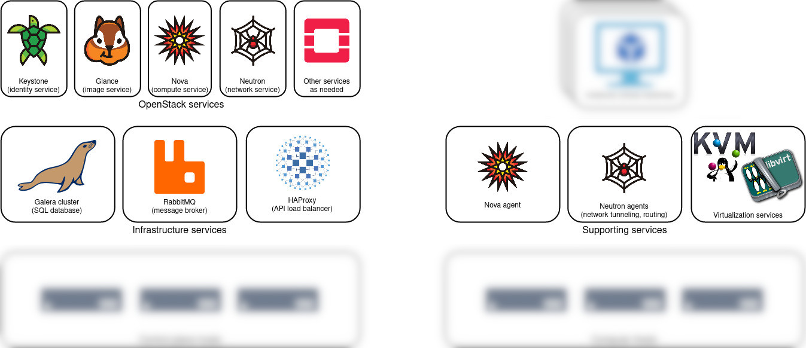

# OpenStack Cloud Planning Guide

## Orientation to OpenStack

OpenStack is a set of inter-operable software services that combine to deliver a cloud infrastructure solution. On top of OpenStack, users build virtual information technology solutions to support their computing, data storage, and networking needs.

Cloud systems provide many types of resources, but the most basic types include the following.

- Instance: a virtual computer that runs software and containers. An instance can be used as a workstation, a server, or as a worker node in a larger cluster.
- Volume: a virtual hard disk drive that stores data. It can be small (under a gigabyte) or very large (many terabytes).
- Floating IP address: a network address that provides connectivity to your instance so that you can host things like web applications.

On a cloud, users can create, manage, and delete these virtual resources on-demand. This flexibility allows technology-powered projects at your organization to grow and evolve quickly, without the need to buy and set up dedicated physical IT hardware for each of them.

### How is an OpenStack Cloud different from a high-performance computing (HPC) system?

While HPC systems are architected to optimize parallel processing speed, cloud systems give up some raw performance in exchange for the flexibility and strong multi-tenancy afforded by virtualization and software-defined networking technologies.

The following things are generally easy for a cloud to provide to users in a self-service way, while being difficult or infeasible for a shared-access HPC system to offer its users.

- Root access to virtual computers, which gets the user:
  - Ability to install _any_ software, without the need to ask an administrator
  - Ability to use a custom kernel or even a custom operating system
- Alongside this root access, there is still strong multi-tenancy to prevent a user from accessing or modifying another project's data.
- Ability to run a full graphical desktop environment, and any graphical software inside it.
- Ability to run persistent servers (e.g. [science gateways](https://en.wikipedia.org/wiki/Science_gateway)), possibly for years.
- Ability to configure virtual network resources, like subnets, routers, and load balancers.
- Ability to use any browser-based interactions like JupyterLab, RStudio Server, and Shiny web applications; and share access to these with others outside the institution.
- Ability to use container orchestration systems like [Kubernetes](https://en.wikipedia.org/wiki/Kubernetes) and [Terraform](https://www.terraform.io).

Another fundamental difference is the scheduler: in a cloud system, resources are created immediately on-demand, and they generally run persistently, until deleted. (This is opposed to a batch scheduler like [Slurm](https://slurm.schedmd.com/overview.html) managing relatively short-lived workloads that may wait to be scheduled.)

Clouds also have the ability to over-commit resources, especially CPU cores. For workloads that are not (or are only intermittently) CPU-intensive, a single physical CPU core can be shared across many virtual instances. This allows the underlying hardware to support more work than would be possible without over-committing and virtualization.

Cloud systems also offer a variety of data storage semantics, from virtual hard drives to distributed shared filesystems and cloud-native object storage.

From the user's perspective, the largest tradeoff is that computation-intensive workloads (especially massively-parallel, [MPI](https://en.wikipedia.org/wiki/Message_Passing_Interface)-based workloads) are generally slower on a cloud than on an HPC system. There is a performance penalty (generally on the order of 10%) with the hardware virtualization and software-defined networking in a cloud environment. There is also variable performance with data storage, depending on how it is backed and exposed.

### How is an OpenStack Cloud that I build different from a public cloud like Amazon Web Services, Google Cloud Platform, or Microsoft Azure?

They often behave similarly, and they can serve the same use cases!

The most fundamental difference is that commercial clouds are essentially a rental service. Your organization and users comprise one or more tenants who pay for virtual cloud resources, generally invoiced monthly, until the resources are deleted. There are separate charges for compute instances, data storage, and data transfer (particularly data transfer from the cloud provider to the outside world). You enjoy the convenience of someone else managing the cloud, for the expense of whatever they charge you for it, now and in the future.

When you build an OpenStack Cloud, you own it. You procure the hardware, you set up the OpenStack services, and you administer it for your users. That cloud belongs to _your_ organization, not Amazon, Google, or Microsoft. Once it is built, you pay the real costs of operating the system. The largest operating expense is typically systems engineer staff time. Other components include machine room floor space, hardware vendor warranty contracts, electricity, cooling, and network connectivity. At a research institution, these resources may already exist in surplus, especially if there is already a high-performance computing system and a team to manage it!

Another difference is scale: the cloud that you build will likely be orders of magnitude smaller than a single Availability Zone of a large commercial cloud. You can only provide as many virtual cloud resources to your community as you have physical hardware available to back it, though overcommitting CPUs affords the operator a tradeoff between total capacity and performance. There are also various "cloudbursting" strategies which allow workloads to scale out to a commercial cloud when an on-premises cloud is fully occupied.

As a user of a commercial cloud, you are also susceptible to varying degrees of vendor lock-in. To programmatically manage resources on one of the three largest commercial clouds is to use proprietary APIs that do not natively inter-operate with each other. Commercial clouds also offer proprietary services (like [AWS Lambda](https://en.wikipedia.org/wiki/AWS_Lambda)), which can be useful, but clients become locked into using these services. There is often a vendor-neutral alternative to a given vendor-specific service which still works on the commercial provider's infrastructure. (One example is [Fission](https://fission.io) as an alternative to AWS Lambda.)

It should not be under-stated how convenient it is to have someone else maintain a cloud for you! This toolkit will get you started with a basic cloud system, but to design, build, operate, and maintain a performant, large-scale, production-quality cloud, you must develop specialized skills on your team (or in yourself), enumerated in the section below. Any IT engineer can learn these skills, but they go well beyond basic Linux systems administration. At a research institution, these are difficult skills to hire for. Still, this guide will help you begin the journey.

For smaller organizations, and organizations with less technology-demanding missions, savvy consumption of commercial cloud services may support the mission more efficiently than building and operating an OpenStack cloud in-house. Researchers at US-based organizations may also qualify for an allocation on [Jetstream2](https://jetstream-cloud.org), a national-scale, production-quality OpenStack cloud for science and engineering research.

### Which skills do I need to build a cloud?

To build a basic cloud with this guide, you need basic Linux systems administrator skills. These are detailed in the [OpenStack Automated Installation Guide](openstack-automated-installation.md#prerequisite-skills).

To build a large-scale, highly-available cloud to support large, downtime-sensitive, and/or mission-critical workloads, you will also need to develop familiarity with:

- Configuration management systems such as [Ansible](https://docs.ansible.com/ansible/latest/index.html)
- Distributed data storage systems such as [Ceph](https://en.wikipedia.org/wiki/Ceph_(software))
- Software-defined networking technologies such as [VLAN](https://en.wikipedia.org/wiki/VLAN)s, [VXLAN](https://en.wikipedia.org/wiki/Virtual_Extensible_LAN), Open vSwitch; optionally [BGP in the Data Center](https://www.nvidia.com/en-us/networking/border-gateway-protocol/) and [routing on the host](https://codingpackets.com/blog/linux-routing-on-the-host-with-frr/)
- High-availability technologies like [keepalived](https://keepalived.readthedocs.io/en/latest/introduction.html)

### OpenStack Services and Components

The most fundamental OpenStack services to know about are:

| Service type | OpenStack name | What it delivers to users               | AWS Equivalent |
|--------------|----------------|-----------------------------------------|----------------|
| identity     | Keystone       | Users and access control for the cloud  | IAM            |
| disk image   | Glance         | Operating systems for virtual computers | N/A            |
| computing    | Nova           | Virtual computers                       | EC2            |
| networking   | Neutron        | Software-defined network resources      | VPC            |

Some other commonly-adopted services include:

| Service type            | OpenStack name | What it delivers to users                | AWS Equivalent     |
|-------------------------|----------------|------------------------------------------|--------------------|
| dashboard for sysadmins | Horizon        | A web interface for using OpenStack      | Management Console |
| dashboard for users     | Exosphere[^1]  | A web interface for less-technical users | Lightsail          |
| block storage           | Cinder         | Virtual disk drives                      | EBS                |
| object storage          | Swift          | Data storage buckets                     | S3                 |
| filesystem              | Manila         | Virtual shared folders                   | EFS                |
| bare metal              | Ironic         | Real, physical computers                 | EC2 Bare Metal     |
| DNS                     | Designate      | DNS host records                         | Route 53           |
| orchestration           | Heat           | Automated control of OpenStack services  | CloudFormation     |
| container orchestration | Magnum         | Push-button Kubernetes clusters          | EKS                |

[^1]: [Exosphere](https://gitlab.com/exosphere/exosphere) is developed independently of the core OpenStack projects, but included here for its focus on making OpenStack clouds more usable for researchers.

#### Control Plane and Data Plane

In a large distributed system like an OpenStack cloud, there is a logical separation between the Control Plane and Data Plane. The control plane consists of the set of OpenStack services (and their dependencies) that _manage_ users' resources on the cloud. The data plane consists of the users' resources themselves. The data plane includes virtual computers, networks, and various types of data storage.

First, let's look at the control plane. It's a sub-set of the diagram at the top of this page.

An OpenStack control plane has a few layers. At the bottom is at least one physical computer (a.k.a. server) to run the control plane services.

The next layer is infrastructure services. These are not part of OpenStack per se, but OpenStack services depend on all them to deliver a functioning cloud.

| Service type      | Name(s)                                         | What it does                                              |
|-------------------|-------------------------------------------------|-----------------------------------------------------------|
| Database          | MariaDB or MySQL (optionally in Galera cluster) | Stores the persistent state of the control plane          |
| Message broker    | RabbitMQ                                        | Delivers messages between service components              |
| API load balancer | HAProxy                                         | Routes and secures network requests to OpenStack services |

#### Infrastructure Services

TODO

#### Types of Storage

This guide will set up storage for images (stored on the control plane host) and instance root disks (stored locally on compute hosts). Here is an orientation to other types of storage you may need in your cloud.

- Instance root disks
- Image storage
- Block storage (Cinder volumes)
- Object storage (Swift, Ceph RADOS)
- Shared filesystem (Manila, CephFS)

#### Types of Networking

TODO

### Load Balancing and High Availability

The entire OpenStack control plane can be load-balanced and/or high-availability.

When configured correctly, this means that every

This means

LB/HA architecture makes sense for larger clouds with downtime-intolerant workloads and hundreds of compute nodes. LB/HA is not essential when you are just getting started, and it is more complex to understand, deploy, manage, and troubleshoot.

If you are

TODO write this section

## Key Decisions

TODO

### General Hardware Considerations

TODO

### Choose Your Control Plane

TODO

### Choose Your Storage Layout

TODO

### Choose Your Network Layout

TODO

### Choose Your Deployment Method

We offer two deployment options: manual (via shell commands) and automated (via Ansible and Docker). You can think of these as using either hand tools or power tools to build your cloud.

Use the manual deployment when:
- You want to learn about each of the OpenStack services, and how they fit together
- You don't trust the automated deployment for whatever reason

Use the automated deployment when:
- You want a working cloud ASAP, and maybe learn how the pieces work later
- You want to use containers for your cloud's control plane
- You will have more than a small handful of nodes to deploy
- You also want automated upgrades for new versions of OpenStack

## References

- [Deploying OpenStack - what options do we have?](https://www.youtube.com/watch?v=8ODdvCogwl8) (from 2019 summit)
  - [Summary](https://imgur.com/Ux5Kyey) from one of the slides
- [OpenStack-Ansible docs](https://docs.openstack.org/project-deploy-guide/openstack-ansible/latest/)
- [kolla-ansible docs](https://docs.openstack.org/kolla-ansible/latest/)
- [Kayobe: An Introduction](https://www.stackhpc.com/pages/kayobe.html)
