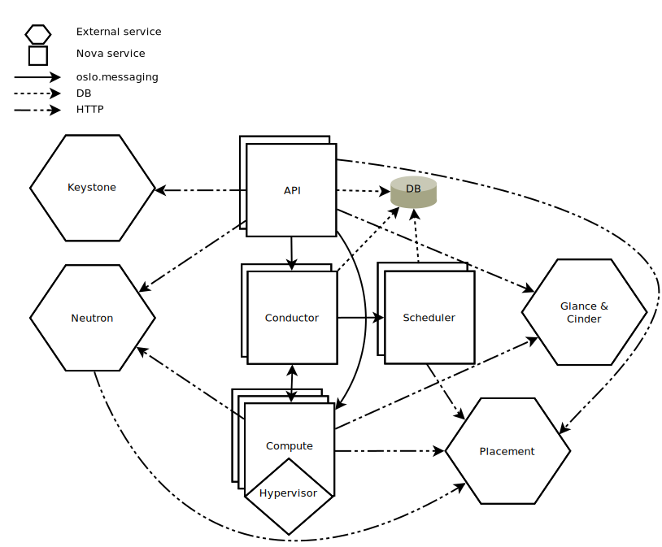

# OpenStack Cloud Planning Guide

## Orientation to OpenStack

OpenStack is a set of inter-operable software services that combine to deliver a cloud infrastructure solution. On top of OpenStack, users build virtual information technology solutions to support their computing, data storage, and networking needs.

Cloud systems provide many types of resources, but the most basic types include the following.

- Instance: a virtual computer that runs software and containers. An instance can be used as a workstation, a server, or as a worker node in a larger cluster.
- Volume: a virtual hard disk drive that stores data. It can be small (under a gigabyte) or very large (many terabytes).
- Floating IP address: a network address that provides connectivity to your instance so that you can host things like web applications.

On a cloud, users can create, manage, and delete these virtual resources on-demand. This flexibility allows technology-powered projects at your organization to grow and evolve quickly, without the need to buy and set up dedicated physical IT hardware for each of them.

### How is an OpenStack Cloud different from a high-performance computing (HPC) system?

While HPC systems are architected to optimize parallel processing speed, cloud systems give up some raw performance in exchange for the flexibility and strong multi-tenancy afforded by virtualization and software-defined networking technologies.

The following things are generally easy for a cloud to provide to users in a self-service way, while being difficult or infeasible for a shared-access HPC system to offer its users.

- Root access to virtual computers, which gets the user:
  - Ability to install _any_ software, without the need to ask an administrator
  - Ability to use a custom kernel or even a custom operating system
- Alongside this root access, there is still strong multi-tenancy to prevent a user from accessing or modifying another project's data.
- Ability to run a full graphical desktop environment, and any graphical software inside it.
- Ability to run persistent servers (e.g. [science gateways](https://en.wikipedia.org/wiki/Science_gateway)), possibly for years.
- Ability to configure virtual network resources, like subnets, routers, and load balancers.
- Ability to use any browser-based interactions like JupyterLab, RStudio Server, and Shiny web applications; and share access to these with others outside the institution.
- Ability to use container orchestration systems like [Kubernetes](https://en.wikipedia.org/wiki/Kubernetes) and [Terraform](https://www.terraform.io).

Another fundamental difference is the scheduler: in a cloud system, resources are created immediately on-demand, and they generally run persistently, until deleted. (This is opposed to a batch scheduler like [Slurm](https://slurm.schedmd.com/overview.html) managing relatively short-lived workloads that may wait to be scheduled.)

Clouds also have the ability to over-commit resources, especially CPU cores. For workloads that are not (or are only intermittently) CPU-intensive, a single physical CPU core can be shared across many virtual instances. This allows the underlying hardware to support more work than would be possible without over-committing and virtualization.

Cloud systems also offer a variety of data storage semantics, from virtual hard drives to distributed shared filesystems and cloud-native object storage.

From the user's perspective, the largest tradeoff is that computation-intensive workloads (especially massively-parallel, [MPI](https://en.wikipedia.org/wiki/Message_Passing_Interface)-based workloads) are generally slower on a cloud than on an HPC system. There is a performance penalty (generally on the order of 10%) with the hardware virtualization and software-defined networking in a cloud environment. There is also variable performance with data storage, depending on how it is backed and exposed.

### How is an OpenStack Cloud that I build different from a public cloud like Amazon Web Services, Google Cloud Platform, or Microsoft Azure?

They often behave similarly, and they can serve the same use cases!

The most fundamental difference is that commercial clouds are essentially a rental service. Your organization and users comprise one or more tenants who pay for virtual cloud resources, generally invoiced monthly, until the resources are deleted. There are separate charges for compute instances, data storage, and data transfer (particularly data transfer from the cloud provider to the outside world). You enjoy the convenience of someone else managing the cloud, for the expense of whatever they charge you for it, now and in the future.

When you build an OpenStack Cloud, you own it. You procure the hardware, you set up the OpenStack services, and you administer it for your users. That cloud belongs to _your_ organization, not Amazon, Google, or Microsoft. Once it is built, you pay the real costs of operating the system. The largest operating expense is typically systems engineer staff time. Other components include machine room floor space, hardware vendor warranty contracts, electricity, cooling, and network connectivity. At a research institution, these resources may already exist in surplus, especially if there is already a high-performance computing system and a team to manage it!

Another difference is scale: the cloud that you build will likely be orders of magnitude smaller than a single Availability Zone of a large commercial cloud. You can only provide as many virtual cloud resources to your community as you have physical hardware available to back it, though overcommitting CPUs affords the operator a tradeoff between total capacity and performance. There are also various "cloudbursting" strategies which allow workloads to scale out to a commercial cloud when an on-premises cloud is fully occupied.

As a user of a commercial cloud, you are also susceptible to varying degrees of vendor lock-in. To programmatically manage resources on one of the three largest commercial clouds is to use proprietary APIs that do not natively inter-operate with each other. Commercial clouds also offer proprietary services (like [AWS Lambda](https://en.wikipedia.org/wiki/AWS_Lambda)), which can be useful, but clients become locked into using these services. There is often a vendor-neutral alternative to a given vendor-specific service which still works on the commercial provider's infrastructure. (One example is [Fission](https://fission.io) as an alternative to AWS Lambda.)

It should not be under-stated how convenient it is to have someone else maintain a cloud for you! This toolkit will get you started with a basic cloud system, but to design, build, operate, and maintain a performant, large-scale, production-quality cloud, you must develop specialized skills on your team (or in yourself), enumerated in the section below. Any IT engineer can learn these skills, but they go well beyond basic Linux systems administration. At a research institution, these are difficult skills to hire for. Still, this guide will help you begin the journey.

For smaller organizations, and organizations with less technology-demanding missions, savvy consumption of commercial cloud services may support the mission more efficiently than building and operating an OpenStack cloud in-house. Researchers at US-based organizations may also qualify for an allocation on [Jetstream2](https://jetstream-cloud.org), a national-scale, production-quality OpenStack cloud for science and engineering research.

### Which skills do I need to build a cloud?

To build a basic cloud with this guide, you need basic Linux systems administrator skills. These are detailed in the [OpenStack Automated Installation Guide](openstack-automated-installation.md#prerequisite-skills).

To build a large-scale, highly-available cloud to support large, downtime-sensitive, and/or mission-critical workloads, you will also need to develop familiarity with:

- Configuration management systems such as [Ansible](https://docs.ansible.com/ansible/latest/index.html)
- Distributed data storage systems such as [Ceph](https://en.wikipedia.org/wiki/Ceph_(software))
- Software-defined networking technologies such as [VLAN](https://en.wikipedia.org/wiki/VLAN)s, [VXLAN](https://en.wikipedia.org/wiki/Virtual_Extensible_LAN), Open vSwitch; optionally [BGP in the Data Center](https://www.nvidia.com/en-us/networking/border-gateway-protocol/) and [routing on the host](https://codingpackets.com/blog/linux-routing-on-the-host-with-frr/)
- High-availability technologies like [keepalived](https://keepalived.readthedocs.io/en/latest/introduction.html)
- Familiarity with the [CAP Theorem](https://en.wikipedia.org/wiki/CAP_theorem) for distributed systems

### What do different sizes of cloud look like?

An OpenStack cloud may be very large or very small. The following three examples illustrate the spectrum of possibilities.

At the small end, you can build a single-node cloud for evaluation and learning purposes. All the infrastructure, OpenStack services, and instances will run on one computer. An old desktop PC is perfect for this. (8 GB of RAM should be enough to run a few small instances at a time. With any less, your little cloud will be severely constrained.) You can use either of the deployment guides in this toolkit. Just keep in mind that your one node will be both the control plane and the compute node.

In the middle, you can build a multi-node cloud with a set of servers that you either purchase new or re-purpose from another use at your organization. One will be a dedicated control plane node, and the rest will serve as compute nodes. This is the size of cloud that this guide is focused on. It will be approachable to deploy and configure, yet provide a lot of opportunity for learning. You will end up with a useful-yet-manageable system that will deliver value for your organization. You can add more compute nodes later. As your storage needs grow, it's also possible to build a Ceph cluster alongside, and integrate it with the cloud. A cloud this size can be managed by one systems engineer alongside other job duties. The cost for this scale of cloud ranges from almost nothing to procure (if it uses spare hardware) and single-digit hours of staff time per week to manage, up to mid-6-digit US dollars to procure and about one full-time-equivalent staff to manage and support. Examples of this size cloud include each of the Jetstream2 [satellite regions](https://docs.jetstream-cloud.org/overview/keydiff/#key-differences-between-jetstream1-and-jetstream2), and the cloud [under development](https://pti.iu.edu/projects/feature-gmu-openstack-2022-05-26.html) at George Mason University.

At the largest end, a [peta-](https://en.wikipedia.org/wiki/Peta-)scale cloud will support a great many simultaneous compute, storage, and networking workloads. A large cloud will have 3 or more dedicated control plane nodes in a load-balanced and highly-available configuration. It will have hundreds or thousands of compute nodes, each having dozens of CPU cores and hundreds of GB of RAM. Some compute nodes may have graphics processing units (GPUs). The supporting Ceph storage cluster will have a uniform hardware configuration across many storage nodes. Each storage node will have many NVMe or rotary storage disks. All of this will be connected by a dense network fabric with several software-defined logical layers for different uses. A large cloud may exist in multiple physical locations (called regions or availability zones) to provide resiliency and more capacity. A cloud this size will have a dedicated team of systems engineers to manage it. These engineers should have complementary specialties in infrastructure automation, distributed storage, networking, and user support. At this scale, it is imperative to use automation and configuration management systems such as Ansible, and the team must automate repeated tasks before they consume inordinate engineer time. The cost for this scale of cloud will be single- to double-digit millions of US dollars to procure, 3 or more full-time-equivalent staff to manage it, plus other costs like data center space, utilities, and hardware warranty contracts. Examples of this size cloud include the Jetstream2 [primary (IU) cloud](https://docs.jetstream-cloud.org/overview/config/), and the OpenStack clouds [deployed at CERN](https://www.openstack.org/blog/10-years-of-openstack-tim-bell-at-cern).

### OpenStack Services

Here is a high-level overview of the services that comprise an OpenStack cloud.

Each OpenStack service delivers a specific kind of resource, or a few related resources. Each service exposes a documented API that users (and other services use) to manage these resources.

The most fundamental services to know about are:

| Service type | OpenStack name | What it delivers to users               | AWS Equivalent |
|--------------|----------------|-----------------------------------------|----------------|
| identity     | Keystone       | Users and access control for the cloud  | IAM            |
| disk image   | Glance         | Operating systems for virtual computers | AMI            |
| computing    | Nova           | Virtual computers                       | EC2            |
| networking   | Neutron        | Software-defined network resources      | VPC            |

Some other commonly-adopted services include:

| Service type            | OpenStack name | What it delivers to users                | AWS Equivalent     |
|-------------------------|----------------|------------------------------------------|--------------------|
| dashboard for sysadmins | Horizon        | A web interface for using OpenStack      | Management Console |
| dashboard for users     | Exosphere[^1]  | A web interface for less-technical users | Lightsail          |
| block storage           | Cinder         | Virtual disk drives                      | EBS                |
| object storage          | Swift          | Data storage buckets                     | S3                 |
| filesystem              | Manila         | Virtual shared folders                   | EFS                |
| bare metal              | Ironic         | Real, physical computers                 | EC2 Bare Metal     |
| DNS                     | Designate      | DNS host records                         | Route 53           |
| orchestration           | Heat           | Automated control of OpenStack services  | CloudFormation     |
| container orchestration | Magnum         | Push-button Kubernetes clusters          | EKS                |

[^1]: [Exosphere](https://gitlab.com/exosphere/exosphere) is developed independently of the core OpenStack projects, but included here for its focus on making OpenStack clouds more usable for researchers.

A given OpenStack service may have multiple server-side components, and it may also communicate with other OpenStack services. The sections below explore this in greater detail.

#### Control Plane and Infrastructure Services

In a distributed system like an OpenStack cloud, there is a logical separation between the Control Plane and Data Plane. The control plane consists of the set of OpenStack services (and their dependencies) that _manage_ users' resources on the cloud. The data plane consists of the users' resources themselves. The data plane includes virtual computers, networks, and various types of data storage.

This section explores the architecture of the control plane. It's not necessary to understand all of this architecture prior to deploying your first cloud! You may find it helpful to learn by building and exploring a working system.

Please refer to the diagram further up this page. An OpenStack control plane has a few layers. At the bottom is at least one physical computer (a.k.a. server) to run the control plane services.

The next layer is infrastructure services. These are not part of OpenStack per se, but OpenStack services depend on all them to deliver a functioning cloud. The infrastructure services are:

| Service type      | Name(s)                                         | What it does                                                              |
|-------------------|-------------------------------------------------|---------------------------------------------------------------------------|
| Database          | MariaDB or MySQL (optionally in Galera cluster) | Stores the persistent state of the control plane                          |
| Message broker    | RabbitMQ or Oslo messaging                      | Delivers messages between service components                              |
| API reverse proxy | HAProxy                                         | Routes, load-balances, and secures network requests to OpenStack services |

Generally, intra-service communication (between components of a service) uses the message broker, and inter-service communication uses the same HTTP (REST) APIs that users do. As an example, let's look at an architecture diagram for one OpenStack service, Nova.

([Source of diagram](https://docs.openstack.org/nova/latest/admin/architecture.html))

Nova has several components: the API server, the scheduler, the conductor, and the compute agent. These components use the message broker (solid line) to communicate with each other, and they persist their state to the SQL database (dashed line). Nova components also place API calls to other services (Keystone, Neutron, Glance, and Cinder) for certain operations, and this communication (line with both dashes and dots) uses the HTTP APIs.

The API reverse proxy service (generally HAProxy) has a few related jobs. HAProxy terminates [TLS](https://en.wikipedia.org/wiki/Transport_Layer_Security) for connections to OpenStack APIs, and it proxies each request (i.e. API call) to a back-end worker process. In a load-balanced or highly-available control plane (which the LB/HA section explains in more detail), HAProxy routes traffic to one of multiple redundant back-ends. In a larger cloud deployment, HAProxy may provide both "internal" and "external" API endpoints for the OpenStack services, each on a different network.

Finally, the named OpenStack services comprise the top layer of the control plane. This is the layer that API clients interact with.

#### Types of Storage

An OpenStack cloud can offer several kinds of data storage for different workloads and use cases.

| Exposed Storage Type             | Use case                                    |
|----------------------------------|---------------------------------------------|
| Nova instance root disk          | Persistent state of each instance           |
| Glance disk image                | Operating system template for new instances |
| Cinder block storage (hard disk) | Hard drive to store data                    |
| Swift object storage (bucket)    | Storage for cloud-native applications       |
| Manila shared filesystem         | Folder shared between instances             |

You don't need all of these to get started, but you may use more of them as your needs evolve. This guide will set up storage for Nova instance root disks (stored locally on each compute node) and Glance disk images (stored on the control plane node).

For the future, know that [Ceph](https://docs.ceph.com/en/quincy/) is a free and open-source distributed storage system that can deliver _all_ the storage types in the table above. Ceph is sometimes called the 'universal storage back-end' for an OpenStack cloud. A Ceph cluster can provide this in a performant and resilient way using commodity server hardware, which means a Ceph cluster can cost considerably less than vendor-specific Storage Area Networks (SAN) or Network-Attached Storage (NAS) systems.

This guide does not cover setup of a Ceph cluster (or integration of Ceph with OpenStack), but the [Ceph documentation](https://docs.ceph.com/en/) will get you started.

#### Types of Networking

An OpenStack cloud has at least three types of networks. First, there is the node management network. A cloud operator uses this network to connect to and administer the nodes. This can also be the network that the OpenStack APIs are exposed on. For smaller clouds, this is usually a "traditional" computer network without software-defined encapsulation or multi-tenancy.

Second, there are the software-defined Neutron networks for communication between instances and their virtual routers. OpenStack clients make API calls to OpenStack Neutron to manage these networks. Neutron can provide virtual subnets with DHCP servers on these networks. Neutron virtual routers route and NAT traffic between these networks and the outside world. The Nova metadata service is also exposed on these networks, and new instances receive their [cloud-init](https://cloudinit.readthedocs.io/en/latest/index.html) configuration via API calls to the metadata service.

Neutron networks are also called "overlay" or "tunneled" networks, because they use technologies like [VXLAN](https://en.wikipedia.org/wiki/Virtual_Extensible_LAN) to encapsulate an OpenStack project's [OSI](https://en.wikipedia.org/wiki/OSI_model) layer 2 fabric, on top of an underlying layer 3 network.

Third, there is the network containing the floating IP address space. This often (but not always) provides shared access to scarce public IPv4 addresses. Users can reserve floating IP addresses and move them between instances. When attaching a floating IP to an instance, Neutron sets up one-to-one network address translation (NAT) between the floating IP address and the instance's fixed (generally private) IP address.

### Load Balancing and High Availability

The entire OpenStack control plane can be load-balanced and/or high-availability.

When configured correctly, this means that every

This means

LB/HA architecture makes sense for larger clouds with downtime-intolerant workloads and hundreds of compute nodes. LB/HA is not essential when you are just getting started, and it is more complex to understand, deploy, manage, and troubleshoot.

If you are

TODO write this section

## Key Decisions

### General Hardware Considerations

A common question is: _What kind of computer hardware do I need for an OpenStack cloud?_ Generally, you can use any computers that will run Linux. If you're starting out, you probably want machines with the common **[x86-64](https://en.wikipedia.org/wiki/X86-64) architecture**. (It is possible to deploy a cloud with ARM or some other micro-architecture, but this has implications for the deployment process and use cases, which this guide does not cover.) To support virtual machine instances, the CPUs in the compute nodes **must support [x86 hardware-assisted virtualization](https://en.wikipedia.org/wiki/X86_virtualization)**. This is a very common feature. Most CPUs have it, even in consumer-grade computers.

Also, it is not strictly necessary, but having two physical network ports in each node will be useful as your network architecture grows. The automated deployment guide assumes each node has two network ports. It is easy to add network ports with a PCI Express network interface controller (NIC). In a pinch, for evaluation purposes, you can use an external USB NIC.

To an extent, it is okay to mix and match hardware of different models / configurations. Compute nodes can have differing amounts of CPU cores and memory. Depending on the flavors that you configure, this may lead to sub-optimal "bin-packing" of instances on compute nodes, but the Nova compute agent will detect each node's physical resources and schedule instances accordingly. If your compute nodes use a mix of different-generation CPUs, you may need to [configure CPU models](https://docs.openstack.org/nova/xena/admin/cpu-models.html) so that instance live migration works between the types of nodes.

Beyond that, the hardware that you need will depend on the features, performance, and capacity that you want to deliver to your stakeholders. For example, you need physical GPUs in order to provide GPU-enabled instances (and configuring them is outside the scope of this guide).

### Choose Your Control Plane

TODO

### Choose Your Storage Layout

TODO

### Choose Your Network Layout

TODO

### Choose Your Deployment Method and Operating System

This toolkit offers two deployment options: manual (via shell commands) and automated (via Ansible and Docker). You can think of these as using either hand tools or power tools to build your cloud.

Use the manual deployment when:
- You want to learn about each of the OpenStack services, and how they fit together
- You don't trust the automated deployment for whatever reason

Use the automated deployment when:
- You want a working cloud ASAP, and maybe learn how the pieces work later
- You want to use containers for your cloud's control plane
- You will have more than a small handful of nodes to deploy
- You also want automated upgrades for new versions of OpenStack

Both of the deployment options in this toolkit assume use of the Ubuntu operating system for both the control plane and compute nodes. The cloud can be installed on other Linux-based distributions, but using them is outside the scope of this toolkit. In any case, the instances that you create on the cloud can use any operating system you want.

## References

- [Deploying OpenStack - what options do we have?](https://www.youtube.com/watch?v=8ODdvCogwl8) (from 2019 summit)
  - [Summary](https://imgur.com/Ux5Kyey) from one of the slides
- [OpenStack-Ansible docs](https://docs.openstack.org/project-deploy-guide/openstack-ansible/latest/)
- [kolla-ansible docs](https://docs.openstack.org/kolla-ansible/latest/)
- [Kayobe: An Introduction](https://www.stackhpc.com/pages/kayobe.html)
