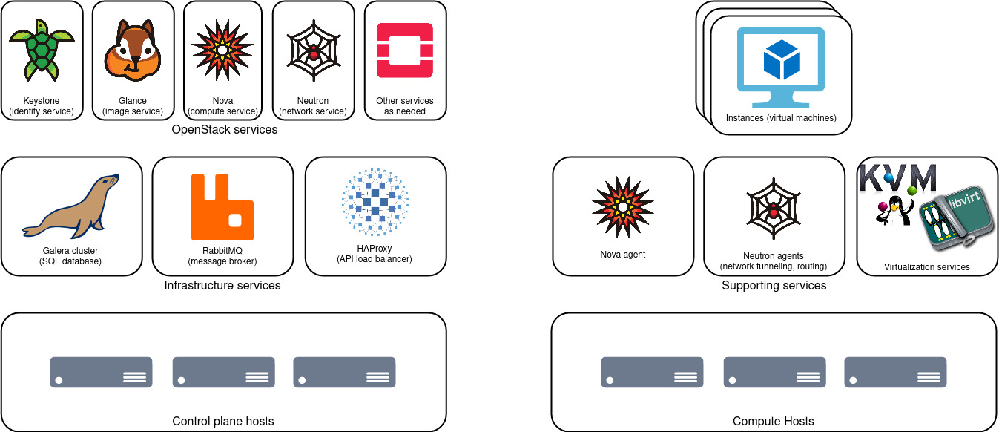

# OpenStack Cloud Planning Guide

## Orientation to OpenStack

OpenStack is a set of inter-operable services that, when combined, deliver a complete cloud infrastructure solution. With this solution, OpenStack users build virtual technology infrastructure to support their computing, data storage, and networking workloads.

The most fundamental OpenStack services to know about are:

| Service type | OpenStack name | What it gets you                        | AWS Equivalent |
|--------------|----------------|-----------------------------------------|----------------|
| identity     | Keystone       | Users and access control for the cloud  | IAM            |
| disk image   | Glance         | Operating systems for virtual computers | N/A            |
| computing    | Nova           | Virtual computers                       | EC2            |
| networking   | Neutron        | Software-defined network resources      | VPC            |

Some other commonly-adopted services include:

| Service type            | OpenStack name | What it gets you                        | AWS Equivalent     |
|-------------------------|----------------|-----------------------------------------|--------------------|
| dashboard               | Horizon        | A web interface for using OpenStack     | Management Console |
| block storage           | Cinder         | Virtual disk drives                     | EBS                |
| object storage          | Swift          | Data storage buckets                    | S3                 |
| filesystem              | Manila         | Virtual shared folders                  | EFS                |
| bare metal              | Ironic         | Real, physical computers                | EC2 Bare Metal     |
| DNS                     | Designate      | DNS host records                        | Route 53           |
| orchestration           | Heat           | Automated control of OpenStack services | CloudFormation     |
| container orchestration | Magnum         | Push-button Kubernetes clusters         | EKS                |

### Control Plane and Data Plane

### Networking

### Types of Storage

This guide will set up storage for images (stored on the control plane host) and instance root disks (stored locally on compute hosts). Here is an orientation to other types of storage you may need in your cloud.

- Instance root disks
- Image storage
- Block storage (Cinder volumes)
- Object storage (Swift, Ceph RADOS)
- Shared filesystem (Manila, CephFS)

## Choosing a Deployment Method

We offer two deployment options: manual (via shell commands) and automated (via Ansible and Docker). You can think of these as using either hand tools or power tools to build your cloud.

Use the manual deployment when:
- You want to learn about each of the OpenStack services, and how they fit together
- You don't trust the automated deployment for whatever reason

Use the automated deployment when:
- You want a working cloud ASAP, and maybe learn how the pieces work later
- You want to use containers for your cloud's control plane
- You will have more than a small handful of nodes to deploy
- You also want automated upgrades for new versions of OpenStack

### References

- [Deploying OpenStack - what options do we have?](https://www.youtube.com/watch?v=8ODdvCogwl8) (from 2019 summit)
  - [Summary](https://imgur.com/Ux5Kyey) from one of the slides
- [OpenStack-Ansible docs](https://docs.openstack.org/project-deploy-guide/openstack-ansible/latest/)
- [kolla-ansible docs](https://docs.openstack.org/kolla-ansible/latest/)
- [Kayobe: An Introduction](https://www.stackhpc.com/pages/kayobe.html)
