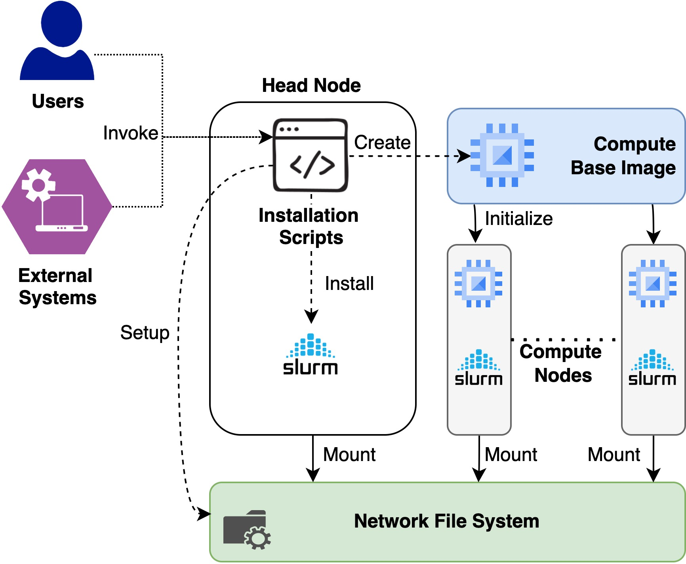

# Elastic Slurm Clusters in Jetstream 2

# Intro

This is an extension of the existing Virtual Cluster setup scripts for Jetstream 1 openstack infrastructure. 
The main differences are based on how the installation is bootstraped and openstack credentials for 
Jetstream 2 are utilized to install a virtual cluster.

# Installation

Installation scripts for Jetstream 1 assumes that you run the scripts in your localhost and connects to the
headnode created at Jestream 1 using the SSH protocol to install the set up. In the new approach, installation
takes place on the already created head node rather than running the scripts in localhost. The reason for doing that is 
to simplyfy the installation by taking out an extra host and providing the seamless installtion automation and integration 
for external tools like Exosphere. Current installation scripts works for Rocky Linux distribution so it is expected to have 
an virtual machine created from the Rocky Linux base image in Jestream 2 before proceeding with the installation



1. Login to the Rocky Linux installed virtual machine. This is the installation host and the head node for the virtual cluster
2. Move to the rocky user if you are in a different user. ```sudo su - rocky```
3. If you have not already done, create an openrc fire for your jetsream2 account by following the [Jestream 2 Documentation](https://docs.jetstream-cloud.org/ui/cli/openrc/)
4. Copy the generated openrc file to the home directory of rocky user
5. Clone the [Virtual Cluster repository](https://github.com/access-ci-org/CRI_Jetstream_Cluster/) and checkout branch rocky-linux
6. If you'd like to modify your cluster, now is a good time!

   * The number of nodes can be set in the slurm.conf file, by editing
   the NodeName and PartitionName line. 
   * If you'd like to change the default node size, the ```node_size=```line 
     in ```slurm_resume.sh``` must be changed.
   * If you'd like to enable any specific software, you should edit 
     ```compute_build_base_img.yml```. The task named "install basic packages"
     can be easily extended to install anything available from a yum 
     repository. If you need to *add* a repo, you can copy the task
     titled "Add OpenHPC 1.3.? Repo". For more detailed configuration,
     it may be easiest to build your software in /export on the headnode,
     and only install the necessary libraries via the compute_build_base_img
     (or ensure that they're available in the shared filesystem).
   * For other modifications, feel free to get in touch! 
7. Now you are all set to install the cluster. Run ```cluster_create_local.sh``` as the rocky user. This will take around
30 minutes to fully install the cluster. 
8. If you need to destroy the cluster, Run ```cluster_destroy_local.sh```. This will decommission the SLURM cluster and any 
runnning compute nodes. If you need to delete the headnode as well, pass the -d paramaeter to cluster destroy script


Useage note:
Slurm will run the suspend/resume scripts in response to 
```scontrol update nodename=compute-[0-1] state=power_down```
or
```scontrol update nodename=compute-[0-1] state=power_up```

If compute instances get stuck in a bad state, it's often helpful to
cycle through the following:
```scontrol update nodename=compute-[?] state=down reason=resetting```
```scontrol update nodename=compute-[?] state=idle```
or to re-run the suspend/resume scripts as above (if the instance
power state doesn't match the current state as seen by slurm). Instances
in a failed state within Openstack may simply be deleted, as they will
be built anew by slurm the next time they are needed.
